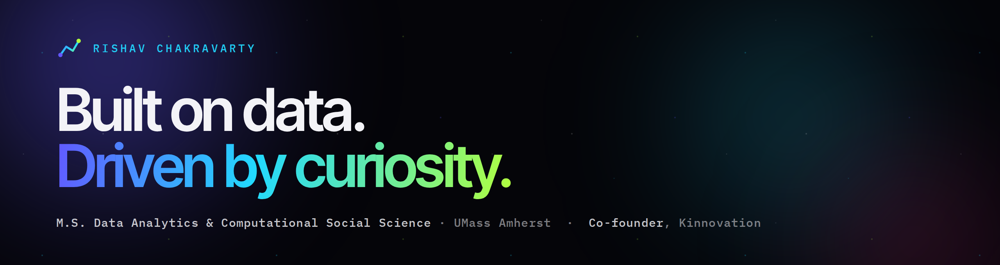

  

---

## About

I came into data science through psychology. Four years of behavioural research
before I wrote a line of production code, which is why I tend to start with the
decision a person actually made rather than the feature that happens to
correlate with it.

I am finishing an **M.S. in Data Analytics and Computational Social Science** at
UMass Amherst. Before that, a postgraduate diploma at UT Austin and a B.S. in
Psychology with a computer science minor at Virginia Tech. I ran a dining hall
for five and a half years while doing most of it.

Everything below with a repository link is something you can clone and re-run.
Where there is no link, I say so rather than quoting a number nobody can check.

**Open to data science, machine learning and analytics roles.**

---

## Work you can open

### [MentalHealthResearch-SocialMedia](https://github.com/rishav-dev/MentalHealthResearch-SocialMedia)

`Python` · `PRAW` · `scikit-learn` · `NLTK VADER` · `Transformers` · `Plotly Dash`

I pulled **6,398 posts and 19,488 comments** out of r/Anxiety, r/depression and
r/mentalhealth, scored every one of them three separate ways (VADER, TextBlob,
and a HuggingFace transformer), then put three classifiers against each other on
the sentiment labels.

| Model | Accuracy | Precision | Recall | F1 |
|---|---|---|---|---|
| Logistic Regression | 0.9125 | 0.8327 | 0.9125 | 0.8708 |
| Random Forest | 0.9125 | 0.8327 | 0.9125 | 0.8708 |
| Linear SVM | 0.9063 | 0.8322 | 0.9063 | 0.8676 |

Those three are closer to each other than any of them is to a careful reading of
what the labels actually mean, and I think that is the honest thing to say about
this kind of work. The finding I would defend in a room came from the topic
modelling instead: the clusters are mostly **not** about mental health. They are
about money, housing, politics and social media. The subreddit is where people
go to talk about anxiety, and what they talk about is rent.

Raw CSVs, scored CSVs, model results and the dashboard are all in the repo.

### [690s-final](https://github.com/rishav-dev/690s-final)

`D3.js` · `Three.js` · `JavaScript` · `Python`

The Evolution of the Billboard Hot 100, 2000 to 2023. A scrollytelling piece
built on chart data joined to Spotify audio features. You scroll and the
argument moves: long-term trends in danceability, energy and valence, then how
the distribution of what makes a song chart has shifted, then a 3D pass through
the feature space for the point where two dimensions stop being enough.

Missing numerics are normalised to null and filtered rather than imputed. A
quietly imputed audio feature is a lie you then plot.

### [StressMap](https://github.com/rishav-dev/StressMap) · [nutri-navigator-app](https://github.com/rishav-dev/nutri-navigator-app) · [rishav-dev.github.io](https://github.com/rishav-dev/rishav-dev.github.io)

Level of Traffic Stress scored across real street networks from OpenStreetMap
data, forked from UMassCDS. A nutrition app in Dart and Flutter. And this
portfolio, hand-built: Next.js, a WebGL boot sequence, and an assistant with no
API key anywhere.

---

## Coursework, no public repository

Listed because the work is real, without headline numbers because you cannot
check them from here. Happy to walk through any of it.

- **Copenhagen Networks Study.** Exponential random graph modelling on Facebook
  friendship ties in a closed student population, with proximity and call
  records alongside. Reported as odds ratios with degeneracy checks, because
  without those the numbers are decoration.
- **AI advice-seeking experiment.** A pre-specified survey experiment on when
  people accept advice from a model instead of a person, analysed with ANOVA.
- **Face recognition.** TensorFlow detection for live video and stills, tuned
  against a real-time latency budget rather than accuracy alone.
- **ReCell dynamic pricing.** Regression over refurbished device sales to find
  which drivers of resale value were real and which the business only believed.
- **S&P 500 clustering.** k-means and hierarchical, run together so I could
  report where they disagreed. That disagreement is a fact about the distance
  metric, and it is the more useful lesson.

---

## Kinnovation

A venture studio I co-founded with **[Kinjal Pandey](https://kinjalpandey.com/)**.
Six ventures, all joint work, all built by the two of us:
[Karnah](https://kinnovationgroup.com/karnah),
[CalendAI](https://kinnovationgroup.com/calendai),
[MeAsmi](https://kinnovationgroup.com/measmi),
[NutriNavigator](https://kinnovationgroup.com/nutri-navigator),
[Witness](https://kinnovationgroup.com/witness-platform), and Trendify AI.

Three pitch competitions, **$1,550** in prize money, won together. Neither of us
has ever pitched alone.

| Venture | Prize | Competition | Awarded by | When |
|---|---|---|---|---|
| Karnah | $750, second place | UPitch Spring 2026 | UMass Amherst Entrepreneurship Club | Apr 2026 |
| Trendify AI | $300 | Minute Pitch | Berthiaume Center, UMass Amherst | Oct 2025 |
| CalendAI | $500 | | Apex Center for Entrepreneurs, Virginia Tech | Nov 2024 |

All six are in development or at concept stage. None is a launched commercial
product and none is fundraising.

More at **[kinnovationgroup.com](https://kinnovationgroup.com)**.

---

## Stack

**Languages** Python · R · SQL · JavaScript · TypeScript · Java · MATLAB · Bash

**ML and analysis** scikit-learn · TensorFlow · pandas · NumPy · Transformers ·
NLTK · statnet / ERGM · time series

**Visualisation** D3.js · Three.js · Plotly Dash · Power BI · Matplotlib

**Platforms** MongoDB · Microsoft SQL Server · Google Cloud · React · Node.js ·
Flutter · Docker · Git

---

## Also

**The Action Taker Award**, LISC Massachusetts and the IXL Center, 2025. Given
for leading the digital upgrades through their Digital Growth Accelerator. The
name is the part I liked. It was for executing, not for proposing.

Selected for the **Franklin County CDC Entrepreneurs Accelerator**, Spring 2026.

---

  

  Amherst, Massachusetts · <a href="mailto:rishavchakra@umass.edu">rishavchakra@umass.edu</a>

